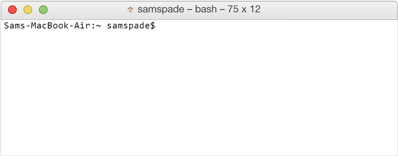

**WDI Fundamentals Unit 1**

---

#####By the end of this Unit, you'll be able to:
* Differentiate between a command line interface and a graphical user interface
* Summarize a basic filesystem structure
* Open a file in a text editor and make changes from the command line
* Identify when you might want to use absolute versus relative paths

##Think Like a Programmer

Most computer users move their mouse, click on icons, drag and drop files from one folder to another.

When you're using the computer this way, you're using what's called a Graphical User Interface or GUI. In a GUI (pronounced "gooey"), you communicate with your computer using a combination of text, images, and gestures.

You are on a journey to transcend being an ordinary user of computers.
You are on your way to becoming a developer, and developers like to interact with computers in a different way – through the command line.

Unlike the GUI, the command line is a *text-based interface*, where you communicate with your computer using text alone.

Back in the day, the command line was the only way to interact with your computer, until the video display terminal was introduced in the mid-60s.

We can perform actions using the command line by **entering commands**. There is a command to perform virtually any action you can imagine on your computer!
There are commands to open an application, create new files, copy files from one place to another, and a lot more.

We'll access the command line using the Terminal (capital-T) application, the most common application on MacOSX and Linux machines.

> **DANGER** Fundamentals will not explore the command line that comes with Windows,
> because most developers don't use it. If you're a Windows user, we recommended
> installing a command line program like [Cygwin](http://cygwin.com/) or [MSysGit](http://msysgit.github.io/) in order to follow along with the syntax we use here.

##Get Started Using Terminal

When you open Terminal, you should see a window like this:

This window is where you'll tell the computer what to do, and where the computer will display its reply.

The **prompt** is the `$` that automatically shows up on the end of the first
line. It's the command line equivalent of "stand-by" and indicates Terminal is
ready to accept your **command**. We'll learn a few commands later in this lesson.

The **cursor** follows the prompt and the text you type will appear here. Just
like in every other setting where you've ever seen a cursor.

The **username** of the person logged in precedes the prompt, and as you can see
above, this user is named *samspade*.
