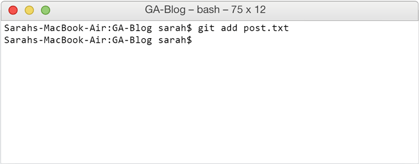

**WDI Fundamentals Unit 2**

---

## Get Started with Git

When you're ready to start tracking changes in a folder, you need to "initialize a repository" in that folder. 

That just means adding a hidden folder called ".git/" to your folder, which contains all the data git needs to operate.


###Initialize your First Repository

To add this special folder, you need to use command line. 
First, you change your working directory to the folder you'd like to track, and then you run the Git command:

```
$ git init
```

> **HINT** When you take a look at your working directory in the GUI you probably won't see any additional files, because (if you remember from Unit 1) hidden files are not visible by default on your computer.  To see the `.git/` directory you need to run `ls -a` from command line.

If you delete the hidden .git directory, you will effectively "uninitialize" your repository and you will lose the data Git collected for you.

> **CAUTION** You should never manually change the internal contents of your `.git` directory, unless your name is Linus Torvalds.

### Saving Versions of Your Project

Like the command line, Git doesn't do a lot of guesswork for you. You need to tell it which files to track and when you want to save a version of them.

Every time you want to save a version, a snapshot of all the contents of that repo, you tell Git to **commit** that version to memory. Other things Git can help with:

* If you want to revert to an old version, you can do that.
* If you want to view the difference between two versions of a file, you can do that too.

Let's take a look at an example.  

We would like to work on a blog post for General Assembly, so we created an empty repo on our desktop called "GA-Blog". The file structure looks like this:

```
GA-Blog
|____.git
| |____config
| |____description
| |____HEAD
| |____hooks
| | |____applypatch-msg.sample
| | |____commit-msg.sample
| | |____post-update.sample
| | |____pre-applypatch.sample
| | |____pre-commit.sample
| | |____pre-push.sample
| | |____pre-rebase.sample
| | |____prepare-commit-msg.sample
| | |____update.sample
| |____info
| | |____exclude
| |____objects
| | |____info
| | |____pack
| |____refs
| | |____heads
| | |____tags
```

This looks like a lot of content, but really there is only one folder in this GA-Blog repo: `.git/`.

To see what Git knows about this project, we would run:

```
$ git status
```

Now take a look at the computer's response:


There are no changes to the GA-Blog folder for Git to remember or "commit".

Let's go ahead and make a new text file called "post.txt" inside of GA-Blog, using the `touch` command.

```
$ touch post.txt
```

Now let's check our Git status:


Git has identified that there is new a file in our repo, but it does not know whether or not we want it tracked.

We want to add the file we made to the GA-Blog repo to our next commit.  To do this we run:

```
$ git add post.txt
```

If we now run `git status` we'll see that the file is ready to be committed:




> **NOTE** Typically, you'll want to track all of the contents of your repo, so instead of specifying a unique file you should write `git add .` (remember: `.` is shorthand for the working directory).


This new version of our GA-Blog project is now in what Git calls the "staging area". You still have the chance to change your mind before committing.

We're ready to tell Git to record this version of our project. Finally, we can type:

    $ git commit -m "created a new post.txt file"

You always must `git add` and `git commit` in order to save versions of your project to your local repo.

The `-m` option allows you to include a message, describing the changes you made for your collaborators or future-you.

You should commit as often as possible to prevent making changes that you can't revert back to.

###The Git Staging Area

One of the unique feautres of Git is its "Staging Area".  Git allows you to add changes to your project to the local repo in two steps:

```
$ git add .
$ git commit -m "message"
```

Why stage? So that if you make multiple changes you can commit them seperately or all at once (basically, it exists to help you better organize your project history).


### Your Commit History

When you're farther into your project, after a bunch of commits to your repository, you might want to look back and see a timeline of the changes you made. 

Hopefully you wrote useful commit messages.

Git allows you to view a list of commits along with the date the commit was submitted, the author of the commit, the commit message AND a unique number to identify the commit by, called a SHA.

This unique number allows Git to remember each commit, and apparently a 40-digit code is easier for Git than "Version1.txt" or "Draft-01-2014.txt". 

To view the timeline of changes, you need to run:

```
 $ git log
```

This will yield a list of entires that look like this:

```
commit 6d33f525a09b9918f75188db164ea2722039830b
Author: Sarah <sarah@gmail.com>
Date:   Wed Jan 28 17:44:03 2015 -0500

    added a new post
    
```

---

Think you're solid on the basics of Git? [Take this quiz, and see how you do.](03_quiz.md)

