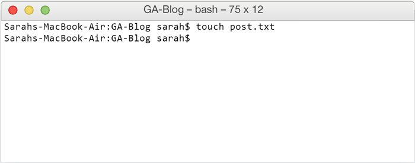

**WDI Fundamentals Chapter 2**

---

## Get Started with Git

Git does a lot for you behind the scenes. When we want to start tracking changes in a specific folder, we "initialize a repository" in that folder. Behind the scenes, this just adds an (invisible) folder called ".git" into the current folder you're in. The git software (which you'll accessing on the command line) uses that folder to store all the data it needs to operate.

To add this special folder, you need to use the command line.

###Initialize your First Repository

The folder that contains `.git/` is called a **repository** (or **repo** for short) and the process of adding `.git/` to an empty folder is called initializing a repository:

    $ git init

Running this command will create a new `.git/` directory, which will contain all the data for the history of your entire project.

> **HINT** When you take a look at a repo in the GUI you probably won't see any additional files, because (if you remember from Unit 1) hidden files are not visible by default on your computer.  To see the `.git/` directory you need to run `ls -a` from command line, which lists all the files in your repo.

If you delete the hidden .git directory, you will effectively "uninitialize" your repository and lose all the history of your repository.

> **CAUTION** You should never manually change the internal contents of your .git directory. Unless your name is Linus Torvalds. In which case we'd love for you to come teach at General Assembly.

### Saving Versions of Your Project

Like the command line, Git doesn't do a lot of guesswork for you. You need to tell it which files to track and when you want to save a version of them. After initializing your repo, you need to inform Git of which files and folders you want it to track.

Then, every time you want to save a version, a snapshot of all the contents of that repo, you tell Git to **commit** that version to memory. Other things Git can help with:

* If you want to revert to an old version, you can do that.
* If you want to view the difference between two versions of a file, you can do that too.

Let's take a look at an example.  

We would like to work on a blog post for General Assembly, so we created an empty repo on our desktop called "GA-Blog". The file structure looks like this:

```
GA-Blog
|____.git
| |____config
| |____description
| |____HEAD
| |____hooks
| | |____applypatch-msg.sample
| | |____commit-msg.sample
| | |____post-update.sample
| | |____pre-applypatch.sample
| | |____pre-commit.sample
| | |____pre-push.sample
| | |____pre-rebase.sample
| | |____prepare-commit-msg.sample
| | |____update.sample
| |____info
| | |____exclude
| |____objects
| | |____info
| | |____pack
| |____refs
| | |____heads
| | |____tags
```

This looks like a lot of content, but really there is only one folder in this GA-Blog repo: `.git/`.

To see what Git knows about this project, we would run:

```
$ git status
```

Now take a look at the computer's response:


There are no changes to the GA-Blog folder for Git to remember or "commit".

Let's go ahead and make a new text file called "post.txt" inside of GA-Blog, using the `touch` command.

    touch post.txt

Now let's check our Git status:



Git has identified that there is new a file in our repo, but it does not know whether or not we want it tracked.

We want to add the file we made to the GA-Blog repo to our next commit.  To do this we run:

```
$ git add post.txt
```

If we now run `git status` we'll see that the file is ready to be committed:


> **NOTE** Typically, you'll want to track all of the contents of your repo, so instead of specifying a unique file you should write `git add .` (remember: `.` is shorthand for the working directory).

This new version of our GA-Blog project is now in what Git calls the "staging area".  You still have the chance to change your mind before committing.

> **CAUTION** You must add files to the staging area before committing them.

We're ready to tell Git to record a snapshot of our project. Finally, we can type:

    $ git commit -m "message explaining what changes you made"

The `-m` option allows you to include a message, describing the changes you made for your collaborators or future-you.

You should commit as often as possible to prevent making changes that you can't revert back to.


### The Git Staging Area
