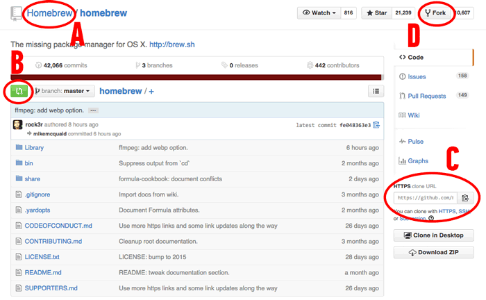

**WDI Fundamentals Unit 2**

---

What is Github?
- [x] A web-based Git repository hosting service
- [ ] A distributed version control system
- [ ] A Dropbox competitor
- [ ] A dating site for developers

> Not quite.
>
> Github is a web-based Git repository hosting service, which offers all of the distributed revision control and source code management (SCM) functionality of Git as well as adding its own features.

How do you update your remote repository with changes to your local repository?
- [ ] git pull
- [ ] git commit -m "update to remote repository"
- [x] git push
- [ ] git update

> Not quite.
>
> To update your remote repository, you need to "git push" from your local repo to the remote repo

You are browsing through Github and you see this incredible project.
You think, "I want a copy of ga-students' repo." What should you do now? 
- [ ] Click on the author's GitHub account (A) and send them a message
- [ ] Submit a pull request by clicking the green button (B)
- [ ] Click on the HTTPS clone URL (C) and copy it
- [x] Click the Fork button (D)

> Not quite.
>
> Best practice is to fork that Github user's repository, to make a copy owned by your own Github account.
> That way you can make updates and push those changes to your remote repo. You can easily sync your fork with their original repo if they make changes too.

---

[Here's another exercise for you](07_exercise.md) - give it a shot.
