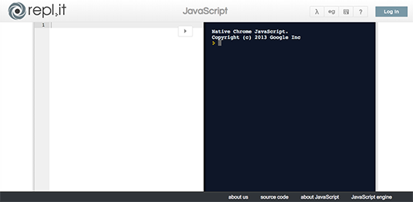

**WDI Fundamentals Unit 3**

---

#####By the end of this Unit, you'll be able to:
* Perform arithmetic and logical operations on data to produce new values 
* Concatenate two strings together in JavaScript
* Write expressions that both assign and evaluate variables.
* Explain what Null is and (generally) how it works.
* Recognize the difference between 'truth-y' and 'false-y' values

---


# JavaScript

Now that you've learned (1) how to create and edit files via the command line, (2) how to track changes in your projects using git, and (3) how to share those projects with the world by publishing them on GitHub, it's time for us to move on to the main event: programming.

It's worth mentioning that although most people think of programming as being about writing code, it's really much more about solving problems. Problems like, say,

  > "How many students are here today?"

  > "How far away am I from the restaurant?"

  > "What's the fastest way to find the file I'm looking for?"

Trying to 'just start coding', without first figuring out the problem is a surefire way to run into trouble. However, in order to understand how to solve a problem, you first need to understand the tools at your disposal.

In the rest of this chapter, we'll be exploring some of the more common tools in a programmer's arsenal. Although we will be specifically looking at the tools available in a language called **JavaScript**, these tools (or similar) are present in nearly every modern programming language, so whether you end up working in JavaScript, Ruby, Python, or Lisp, having a strong understanding of these basics is invaluable.

<br>


## Repl.it
To start playing around with JavaScript, we'll be using a web platform called **[Repl.it](http://repl.it/languages/JavaScript)**.



As you can see in the screenshot above, repl.it features two main windows. On the right, with the black background, is the *console* - this tool (much like the Terminal on your computer) will accept a single instruction from the user and attempt to run it when the user hits "enter". On the left, with the white background, is the *editor*. The editor allows us to write several instructions in sequence; to execute these instructions, click the 'play' button near the top.

To save your repl.it session, just click the 'save' button in the upper right - it'll generate a URL that you can bookmark and come back to any time you want.


<br>

## Git and GitHub

We'll also be using Git and GitHub for the exercises in this chapter. We've prepared a mostly-blank repository for you on GitHub called [`fundamentals-exercises`](); fork it on GitHub, and clone it down to somewhere on your computer using the command

```
git clone git@github.com:<yourusername>/wdi-fundamentals-exercises.git
```

Add all of the code you write to this directory; as you finish each assignment, push changes back up to GitHub and (once you've completely finished with the entire book) initiate a ***pull request*** to submit your code for our review.

Ready to begin? [Let's go](03_chapter/02_lesson.md).


