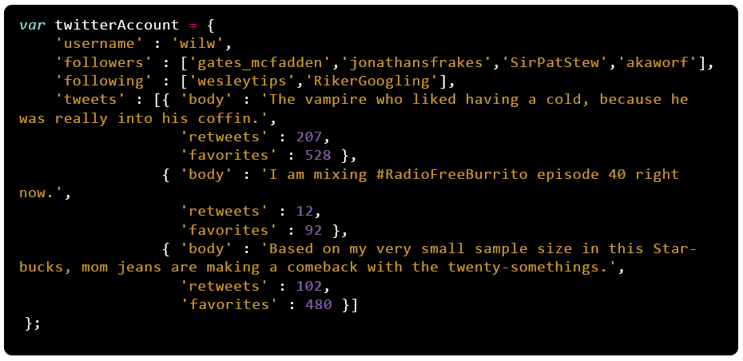

**WDI Fundamentals Unit 6**

---

Given the following code, how would you access 'hunter2'?
`var loginInfo = {"username": "johnny23", "password": "hunter2"}`

- [ ] loginInfo["hunter2"]
- [ ] loginInfo("hunter2")
- [x] loginInfo["password"]
- [ ] loginInfo("password")

> Not quite.
> To access the value associated with the key password you would need to use
> the command: loginInfo["password"]

Given the above code, how would you change the username to "billy96?"

- [ ] login_info("username") = "billy96"
- [x] login_info["username"] = "billy96"
- [ ] login_info["username", "billy96"]
- [ ] login_info("username", "billy96")

> Not quite.
> You modify an associative array in much the same way you would a regular array. Instead of referring to the element by the index, you would specify the key value of the element you'd like to change.
> In this example, you would write `login_info["username"] = "billy96"`

---

Given the following data structure: 

What command could you enter to answer each of the following questions?

---

An array of the accounts that wilw follows:

- [x] twitterAccount.following
- [ ] twitterAcount[1]
- [ ] twitterAccount="followers"

> Not quite.
> To access the element associated with the "following" key, you would need to
> write either: `twitterAccount.following' or 'twitterAccount['followers']`

The 'body' of wilw's first tweet

- [ ] twitterAccount.tweets.body[0]
- [x] twitterAccount.tweets[0].body
- [ ] twitterAccount[0]["body"][0]

> Not quite.
> Both of these would be acceptable answers:
> 'twitterAccount["tweets"][0]["body"]' or 'twitterAccount.tweets[0].body'

The total number of tweets that have been made by wilw so far?

- [x] twitterAccount['tweets'].length
- [ ] twitterAccount["tweets"].count
- [ ] twitterAccount[3].length

> Not quite.
> To count the number of tweets in this Twitter Account, you would need to use
> the length method on the array associated with the "tweets" key, like so:
> `twitterAccount.tweets.length` or `twitterAccount["tweets"].length`

---

[One last exercise - this time on associative arrays.](10_exercise.md)
